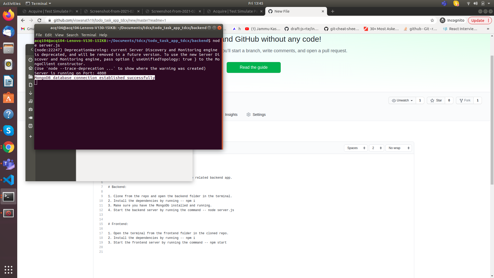

# todo_task_app_tdcx

# Have divided the app to frontend app and the related backend app.

# Backend:

1. Clone from the repo and open the backend folder in the terminal.
2. Install the dependencies by running -- npm i
3. Make sure you have the MongoDb installed and running.
4. Start the backend server by running the command -- node server.js

# Frontend:

1. Open the terminal from the frontend folder in the cloned repo.
2. Install the dependencies by running -- npm i
3. Start the frontend server by running the command -- npm start

Login

Screen with No Tasks

Add a New Task

Tasks Grid View

Mobile View Screens:
Login View:

Tasks View:

